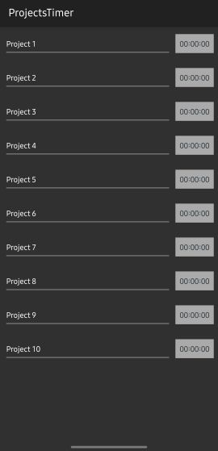

# ProjectTimer 

Day-by-day timer to collect the time worked on a project.  

[Back to Main](https://michelvilleneuve.github.io/)  

Select the project tab to enter the project name.  
Select the time tab to start the timer and stop.  
